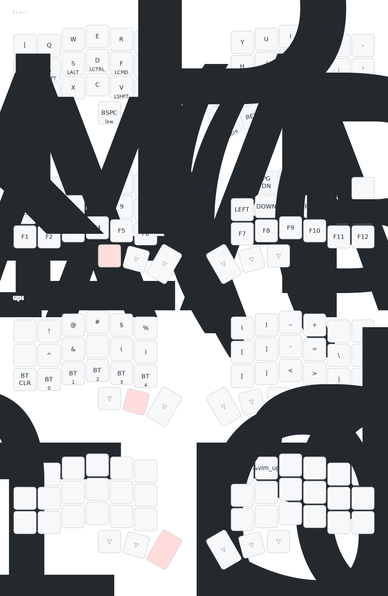

# ZMK Corne V3 + nice!nano configuration

The below keymap is generated using [this tool](https://caksoylar.github.io/keymap-drawer). The corresponding PyPi project is located [here](https://pypi.org/project/keymap-drawer/). The keymaps and configs are influenced by [this](https://github.com/SethMilliken/swept-corne-zmk/tree/seth) git repository.

## Keymap

[Real time visualisation and configuration tool](https://nickcoutsos.github.io/keymap-editor/)
