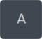
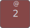
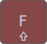
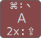
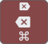

# ZMK Custom Layouts

[](https://zmk.dev/)
[](https://github.com/Townk/zmk-config/actions/workflows/build.yml)

This repository contains the ZMK user configuration for all my keyboards that
use the [ZMK](https://zmk.dev/) firmware.

The way I organize the keyboards' layouts is to have a single _master layout_,
with more keys defined than any keyboard I have. Then, each individual Keyboard
configuration would define a _“layer adapter”_ mapping the keys in the layout
that it uses to its physical position.

Every keyboard layout has its layout documentation (located under the `docs`
directory), but since they all share the majority of my layout, you should
expect plenty of repeating texts between them.

My suggestion is to read the layout documentation for the keyboard you're
looking for, then, when you understand it, go check out the other docs. This
way, you won't have to read the same text twice, or explanations for things you
aren't concerned with in the first place.

Currently, in this repository, I have layout for:

- [Corne (6 columns)](docs/corne.md)
- [Rolio46.2](docs/rolio.md)
- [Lily58](docs/lily58.md)

If you did not click on any of the layout links yet, there is some general
information I would like you to have to help you understand them better.

## Symbols Glossary

Inside the keymap files and on the layout map images, you'll see a series of
symbols that are not well-used in ZMK configurations out there, so to understand
the layout easily, here is a table with all the symbols I use:

| Symbols                                                       | Description                                   |
|:-------------------------------------------------------------:| ----------------------------------------------|
|           | Command (Super)                               |
|           | Control (Ctrl)                                |
|             | Option (Alt / Meta)                           |
| ⇪                                                             | Caps Word                                     |
|               | Shift                                         |
|                                | Globe                                         |
|            | Turn On Caps-Word                             |
|                     | Space                                         |
|                   | Enter (Return / Ret)                          |
|                      | Delete backwards (Backspace / Bksp)           |
|         | Delete forward (Del)                          |
| ↖                                                             | Home                                          |
| ⇞                                                             | Page Up                                       |
| ⇟                                                             | Page Down                                     |
| ↘                                                             | End                                           |
|             | Backtab                                       |
|                         | Tab                                           |
|                    | Volume up                                     |
|                 | Volume down                                   |
|                    | Mute                                          |
|               | Screen brightness up                          |
|             | Screen brightness down                        |
|      | Keyboard backlight off                        |
|           | Keyboard backlight decrease                   |
|             | Keyboard backlight increase                   |
|                  | Previous song                                 |
|                 | Play / pause                                  |
|                | Next song                                     |
|                                | Stop media                                    |
|                           | Launchpad                                     |
|   | Mission Control (`⌘ ⌃ ↑`)                     |
|             | Show application windows (`⌘ ⌃ ↓`)            |
|          | Spotlight                                     |
|                          | Cut (`⌘ X`)                                   |
|                        | Copy (`⌘ C`)                                  |
|                      | Paste (`⌘ V`)                                 |
|                                | Undo (`⌘ Z`)                                  |
|                                | Redo (`⇧ ⌘ Z`)                                |
|  →                        | Find Next (`⌘ G`)                             |
| ←                         | Find Previous (`⇧ ⌘ G`)                       |
|  | Previous word (`⌥ ←`)                         |
|        | Next word (`⌥ →`)                             |
|     | Beginning of line (`⌘ ←`)                     |
|      | End of line (`⌘ →`)                           |
|  →       | Go to Virtual Desktop on the Right (`⌘ ⌃ →`)  |
| ←        | Go to Virtual Desktop on the Left (`⌘ ⌃ ←`)   |
|  →                 | Next window (`` ⌘ ` ``)                       |
| ←                  | Previous window (`⌘ ~`)                       |
|                | Alternate layout (COLEMAK)                    |
|      | Bluetooth profile                             |
|            | Bluetooth profile clear                       |
|        | Toggle OLED display                           |
|    | LED RGB underglow actions                     |
|                                  | Output mode (USB / BLE)                       |
|                     | Turn off host computer                        |
|                   | Reset firmware                                |
|                 | Bootload mode                                 |
|   | Numbers Layer                                 |
|   | Symbols Layer                                 |
|   | Navigation Layer                              |
|   | Media Layer                                   |
|   | Buttons Layer                                 |
|   | System Layer                                  |
|                  | Lock layer in place                           |

## Key Representation

When looking at the layout map images, you'll see that some keys have their
background highlighted with different colors than the rest; many of them, also
have more than one symbol as their labels.

To understand what all those symbols mean, let's first, look at how a key that
has a single purpose is represented:



This key has nothing special about it. When I tap it, it will output `a`, and if
I hold it down, it will output `a` repeatedly, until I release it.

My layouts, like virtually every other keyboard layout in the world (including
the standard ones that most people use), have keys that are used exclusively to
alter what other keys output when held-down. When that happens, we say that the
key caused the keyboard to _“switch layers”_, for instance:


This is the _Shift_ key, which forces other keys to output the uppercase version
of itself, or in certain cases, it can force the key to output an entirely
different symbol than the normal one (e.g., the number keys in most standard
keyboards).

When a key outputs a different symbol than the uppercase version of the normal
output while holding down the _Shift_ key, it has the extra symbol drawn above
the normal one, for instance:



When tapped while no other hey is held-down, it will output `2`, but if the
_Shift_ key is held-down while tapping it, it will output `@`.

Now, there is a special type of key that you don't find in standard keyboards
easily. Those keys output their normal value when tapped, and a different one
when held-down. These keys are called _“Hold-Tap”_ keys. Most custom layouts
use them, specially layouts for keyboards with less than 50 keys.

When those keys are shown in my layout maps, they have the _“hold-down”_ value
displayed below the normal symbol. For instance:



This key is a normal `F` key that output `f` when tapped, and `F` when tapped
while holding down the _“Shift”_ key. However, when I hold this key down, it
behaves like the _“Shift”_ key, meaning that if I hold it down, and then press
the key for number `2`, the keyboard will output a `@` character.

> [!NOTE]
> Unfortunately, Keymap Drawer does not support representations of
> [Mod-Morph](https://zmk.dev/docs/behaviors/mod-morph) or
> [Tap-Dance](https://zmk.dev/docs/behaviors/tap-dance), so I had to come up
> with a syntax to represent them:
>
> 
>
> When you see a symbol followed by `:`, followed by another symbol on either,
> the _shifted symbol_ or _held symbol_ positions, it is indicating a _morph_
> behavior, meaning: `<morph trigger>: <output symbol>`. In the example above,
> when the `A` key is tapped while holding down the _Command_ key, the result
> output will be the `` ` `` key.
>
> When you see a counter in the form of `<N>x`, followed by `:`, followed by a
> symbol on either the _held symbol_ or _shifted symbol_ positions, it indicates
> a _tap-dance_ behavior, meaning: `<tap count>x: <output symbol>`. In the
> example above, when the `A` key is tapped twice, it will output a `CAPS_LOCK`.

When we put all this together, and we see the following key in a layout map:



We know that this key is a normal _“Delete Backwards”_ when tapped by itself,
and a _“Forward Delete”_ when tapped while holding down _“Shift”_. But when I
hold it down, it will be like I'm holding down the _“Command”_ key on my macOS.

## Tap-Hold Behavior

Usually, a tap and hold key goes into the “hold” mode when the key is held-down,
which prevents the user from holding the key down and having its output repeated
until the key is released.

To solve this issue, I used a (relatively new) feature of ZMK called
[`quick-tap-ms`](https://zmk.dev/docs/behaviors/hold-tap#quick-tap-ms), which
always produces the “tap” behavior when the key is pressed twice in quick
succession. This allows me to have repeatable keys, even when they're a
“tap-hold” type of key.

For instance, let's assume the `F` tap-hold key shown in the previous section.
The sequence of taps and their output would be:

- `F` down, `F` up :: it will output a single `f`;
- `F` down :: it will output a _“Shift”_ key;
- `F` down, `F` up, `F` down :: it outputs `ffffffffff…` until the key is
  released.

## Globe Key

Around 2021, Apple made the `(FN)/Globe` key a standard key on all its
keyboards, so as an Apple user, I wanted to have the same ability to access some
features using my keyboard as I can using a standard Apple keyboard.

ZMK has partial support for the _Globe_ key (check issue
[#937](https://github.com/zmkfirmware/zmk/issues/947) for details on the mater),
it can only be used as a _“holding”_ key.

## Caps Lock

I think `CAPS_LOCK` is evil. No keyboard should ever have that key available.
That being said, I admit that sometime is very convenient to type a fully
capitalized word without having to hold down the _Shift_ key.

Fortunately, ZMK solved this by allowing us to use the
[`CAPS_WORD`](https://zmk.dev/docs/behaviors/caps-word) behavior, where, when
tapped, it will turn on the `CAPS_LOCK` just to the next word typed. Thereafter,
the keyboard will put you on a normal typing mode again.

In this layout configuration, the `CAPS_WORD` feature is triggered when I press
both _“Shift”_ keys together.

## My methodology

You may be asking yourself (probably not, but I'll pretend you are) what is my
process to choose where keys go in all these layouts?

In all honesty, I don't have one. I usually use the keyboard and try to note
repetitive mistakes or things that require a bigger effort to accomplish. When
they become somewhat highly noticeable, I think about where the keys causing
this issue should be for me to have less of these mistakes happening. Then, I
change the layout to match my new hypothesis, flash the keyboard, and use the
layout as if nothing happened.

Over time, the fixes that worked will fade in the background while new issues
that deserve my attention, as well as the fixes that did not work, will show up
again and again. When that happens… Rinse and repeat.

## Local build

If you want to build this configuration locally, first, follow [ZMK's
instructions](https://zmk.dev/docs/development/setup/native) to be able to build
the firmware itself.

Then, get a Python environment ready (you can use your OS Python, or you can
create a virtual environment just for the project), and install the required
dependencies to it:

```sh
$ pip install -r support/requirements.txt
```

You can build the firmware for all keyboards I have with the following command:

```sh
$ west build -p -d build/corne-left -b nice_nano_v2 -- \
    -DSHIELD=corne_left \
    -DDTS_EXTRA_CPPFLAGS="-DUSE_MOLOCK=1" \
    -DZMK_CONFIG="$TOWNK_ZMK_CONFIG_DIR/config" \
  && west build -p -d build/corne-right -b nice_nano_v2 -- \
    -DSHIELD=corne_right \
    -DDTS_EXTRA_CPPFLAGS="-DUSE_MOLOCK=1" \
    -DZMK_CONFIG="$TOWNK_ZMK_CONFIG_DIR/config" \
  && west build -p -d build/lily-left -b nice_nano_v2 -- \
    -DSHIELD="lily58_left nice_view_adapter nice_view" \
    -DDTS_EXTRA_CPPFLAGS="-DUSE_MOLOCK=1" \
    -DZMK_CONFIG="$TOWNK_ZMK_CONFIG_DIR/config" \
  && west build -p -d build/lily-right -b nice_nano_v2 -- \
    -DSHIELD="lily58_right nice_view_adapter nice_view" \
    -DDTS_EXTRA_CPPFLAGS="-DUSE_MOLOCK=1" \
    -DZMK_CONFIG="$TOWNK_ZMK_CONFIG_DIR/config" \
  && west build -p -d build/settings-reset -b nice_nano_v2 -- \
    -DSHIELD="settings_reset" \
    -DZMK_CONFIG="$TOWNK_ZMK_CONFIG_DIR/config"
```

After the first build, you can simplify the build command to the following:

```sh
$ west build -d build/corne-left \
  && west build -d build/corne-right \
  && west build -d build/lily-left \
  && west build -d build/lily-right \
  && west build -d build/settings-reset
```

And if you make any modifications to the keymap, make sure you update the assets
used in the documentation, by running the `update-layout-maps.sh` script from
the `support` directory:

```sh
$ cd "$TOWNK_ZMK_CONFIG_DIR"
$ ./support/update-layout-maps.sh
```

## Disclaimers

Layout map images are all generated with
[Keymap-Drawer](https://keymap-drawer.streamlit.app/) from Cem Aksoylar. If you
have your custom ZMK or QMK configuration, I highly recommend you to check it
out.

My homerow mod configuration is based on the fantastic _“timeless homerow mods”_
from [Robert U (@urob)'s ZMK Configuration](https://github.com/urob/zmk-config).
You should absolutely check this configuration for examples.

The pattern I used to share my layout across multiple keyboards was a suggestion
from Rafael Romão ([@rafaelromao](https://github.com/rafaelromao/keyboards)) and
Cem Aksoylar ([@caksoylar](https://github.com/caksoylar)) on the [ZMK Discord
server](https://discord.com/channels/719497620560543766/813882537436905552/1253152742910984282),
so I spent some time digging through their ZMK configurations to learn, and copy
the pattern into my layout.

Unfortunately, due to the nature of my layout, you cannot use this configuration
with Nick Coutsos [Keymap-Editor](http://nickcoutsos.github.io/keymap-editor).
