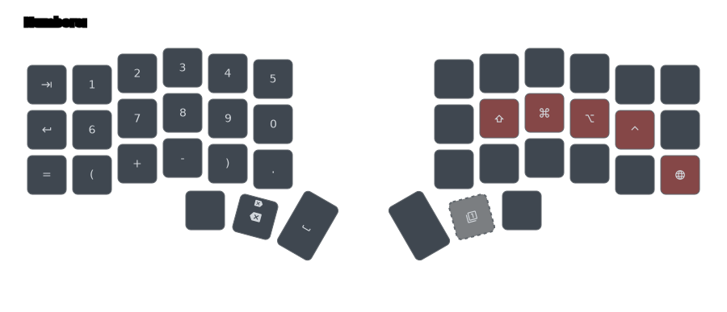
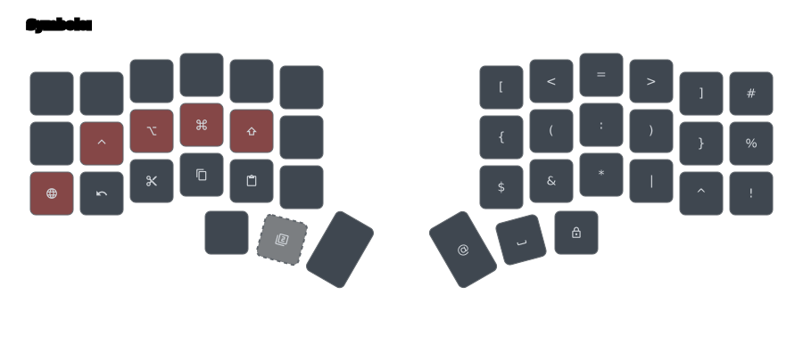
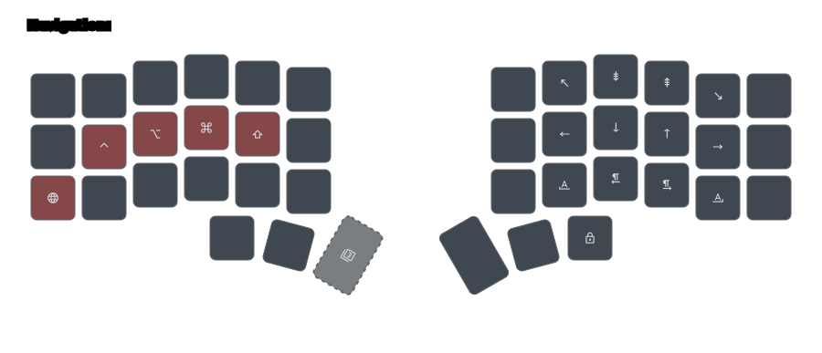
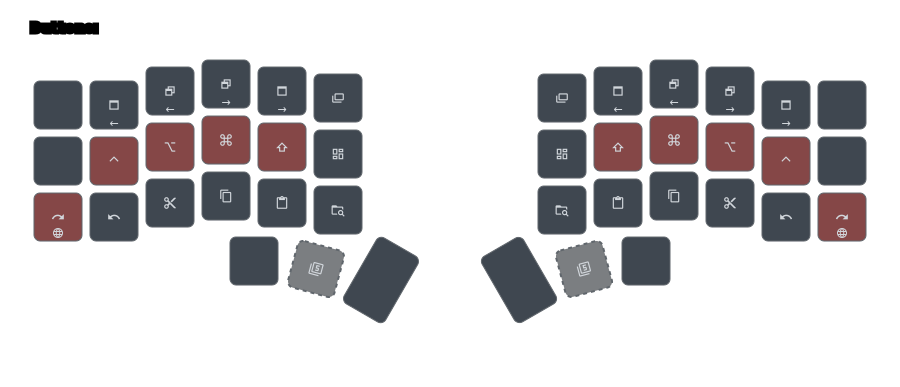
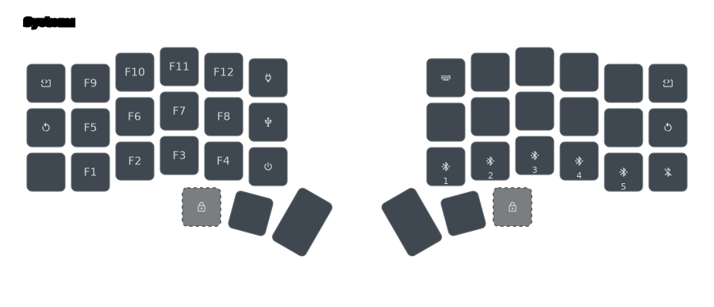
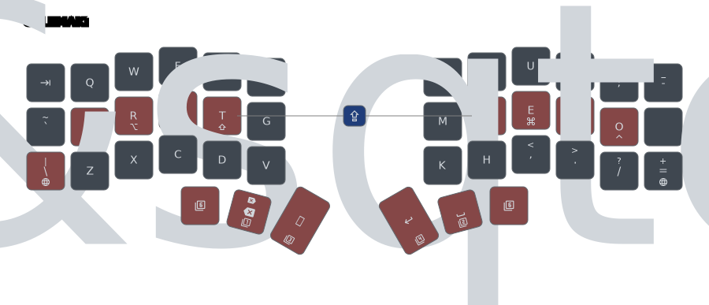

# Corne-42 Layout

My small split keyboard layout is a mashup of several excelent layouts I found
online, with a heavy season of my own imagination. So yes, you probably already
saw some (if not most) of the things I put in this layout somewhere else.
Nevertheless, there are some modifications I made that are worth reading about.

The first recomendation I got after jumping into the sub-50 keyboard world, was
to try the Miriolku layout. I heard and read so much of this recomendation, that
I started to think that this should be the defactor layout to use with a Corne.

The problem I have with things "ready to use", is that everything about it, must
resonate with me if I want to use it.

Some things do... most dont!

After deep diving into the Mirioky layout concepts, I found more interested on
the Layout UX Design then on its implementation, so I decided to try to apply
the same concepts the layout has, on the ideas and other layouts that I already
created in the past.

The result of this, is what you're reading in this document!

Some of the notable features are:

- **Single-sided layers**: An extra layer should never have functional keys on
  both sides of the keyboard. If you bring a layout up using your left hand, all
  its functional keys should be located on the right side of the keyboard. This
  allows you to have accessible modifiers on the same hand that invoked the
  layer, making every layer key able to be combined with a modifier;
- **Sepatate layers for Symbols and Numbers**: I tried to put each one of these
  layers on different sides of the keyboard, to help my brain to identify what
  hand to use in which situation;
- **Dedicated layer of shortcuts**: The only layer that is mirrored on both
  sides of the keyboard;
- All layers are momentary, but you can lock them in plpace;
- Keys morph into other keys depending on the situation and requirement;
- Homerow mods from @urob;

## Base Layer

### 6 vs. 5 columns

Many Corne layouts out there have have a big number of layers that help with the
overall _flow_ while using a keyboard with them. While this is a great way to
solve some problems you may face otherwise, I decided to approach the key count
problem differently.

At first, I was set on making this layout, basically, a 3x5 layout with _"extra
comfort"_ keys on the side. This way, I could migrate to a Corne-36 without big
re-learning.

For its majority, the core of my layout still follows this principal, but when I
start using it, I found one area where the layout was not up to the standards I
want it to be: System navigation.

I'm not sure about Linux or Windows, but on macOS you have some pretty
convenient shortcuts you can use to switch between open applications and
application windows.

The first one is the equivalent of a `⌘ ⇧ ⇥` (`Command+Shift+Tab`). As you can
see just by the shortcut itself, you have to use 3 fingers to cycle back on the
application list when switching between apps with a `⌘ ⇥` (`Command+Tab`),
which, in my world, is never a good thing.

To solve this issue, Apple made the key right above the `⇥` (the `` ~ ` `` key)
work like the `⌘ ⇧ ⇥`. This way, moving forward and back on the application list
is just a mater of moving your finger from `⇥` to the key above of it.

To mimic this behavior, I used a _"Mod-Morph"_ behavior on the key "bellow" my
`⇥` key. Although a bit different than the original, it still gives me the same
workflow, and keep keys I can use in the process free, like the `Q` key that if
pressed while still holding down the `⌘` key, it will close the highlighted
application from the list.

I also tackled the switching between open windows of the current application the
same way. Since the `` ⌘` `` key, when pressed to start an action, starts the
window switch instead of the application one, I did the same thing with the key
bellow it in my layout. Now I can comfortably cycle between apps and windows
with my layout.

That is only possible because I'm fully using the side keys of the keyboard,
which I, initially, tried to avoid.

If you plan to adapt this layout to a 3x5 keyboard, make sure this use-case is
not something you will miss.

## Numbers Layer

While looking into other layouts out there, I notice that most people tend to
position their numbers like an inverted phone keypad, mimicking the numeric
keypad of full keyboards.

Until now, I also position my number this way, because it made sense, but then,
I was watching a [video](https://www.youtube.com/watch?v=wTMcH7u-vu0) about the
Corne keyboard (not directly related to layout), and I just went to check this
guy's layout because of no real reason.

When I saw his layer where the numbers are located, at first, I thought that
having the numbers as two rows of five columns was a pretty bad idea. Why not
use the well-established _"NumPad"_?

After a couple of days, I realized I was thinking a lot about that numbers
layer, so I decided to give it a go, just to make my damn brain let go of it.

The first time I use it though, made my idea about this concept to change
drastically. It was so intuitive to type numbers for me, that I started to
wonder why it felt way easier to type numbers this way then with the traditional
_"NumPad"_?

After thinking long about it, I believe the problem is a combination of lack of
muscle memory for the _"NumPad"_ layout (I never really used them), plus my
ADHD. Those two things combined make me have that moment of pause while typing,
every time I needed to cross the "row boundary" on the _"NumPad"_ layout. Since
it has 4 rows to accommodate all the numbers and some symbols, I always had 4
opportunities to pause my typing flow when typing numbers.

With the 2-row concept, that amount of opportunities is reduced to 2, and since
two different things is usually pretty easy for my brain to associate, the
layout became more "intuitive" for me.

> [!NOTE]
>
> All the concepts I mention in this document are intimately connected to my
> personal preferences. Please, don't take anything I mentioned here as the
> right way to do things. I spend quite some time adapting everything for my
> personal needs, which most likely, are not the same as yours.

## Symbols Layer

One of the things I always avoided in the past was to deal with my symbols
layers. I always defined them, but barely use them. Because of comfort or strong
muscle memory, I was always typing the characters on the symbol layer the
traditional way, by holding down _"Shift"_ and tapping a number.

This is not necessarily bad, but when I start using the Corne-42, it become
pretty clear that I could not do the same thing here. Hence, I started my
journey to find the best symbols layer **for me**.

I looked into the [Miryoku](https://github.com/manna-harbour/miryoku/) layout
since so many people highly recommend it, but personally, I found way too
complex for my taste, and the lack of symmetry on the pair characters (`(`, `)`,
`[`, `]`, `{`, `}`, and `<`, `>`) a bit too annoying for me to go through the
effort of learning it. I have to say though, that the buttons layer from it is
pretty interesting, and I might try to find a way to incorporate it here.

I checked several layouts to find something that would give me at least a head
start on this, but everything looked a bit too weird for my personal taste.

Until I bump into this image on Reddit:

> [!NOTE]
>
> I tried to find the author of this image, or the original source for it, but I
> couldn't, so if you know anything about it, please let me know and I'll update
> this document with the proper information.

This layout seams to target standard keyboards, and its presentation is so
well-designed that looks like is part of a commercial product.

As I was reading through this layout's documentation, it started to click the
logic behind the positions of the symbols, so it did not take long for me to try
to adapt it to my small keyboard.

The result is my _"Symbols"_ layer that you can see on my layer map. The main
difference between my layer and the original source is the inverted place I put
the symbols that match the positions of their numeric counter-part. I did this
because that put those five symbols in a position that makes my symbols layer
behave like a standard _"Shift"_ on normal keyboards. This single change changed
everything to me, and made me start using the whole thing without thinking too
much.

I did some other minor changes due to my method of finding better places for my
keys, but I can say that the core of my symbols layers is a direct descendant of
this "Spaceship Layout", even though I do not know where it came from.

## Navigation Layer

## Media Layer

## Buttons Layer

## System Layer

## Alternative Layout

## My methodology

You may be asking yourself (probably not, but I'll pretend you are) what is my
process to choose where keys go?

In all honesty, I don't have one. I usually use the keyboard and try to note
repetitive mistakes or things that require a bigger effort to accomplish. When
they become somewhat highly noticeable, I think on where the keys causing this
issue should be for me to have less of these mistakes happening. Then, I change
the layout to match my new hypothesis, flash the keyboard, and use the layout as
if nothing happened.

Over time, the fixes that worked will fade in the background while new issues
that deserve my attention, as well as the fixes that did not work will show up
again and again. When that happens... rinse and repeat.
